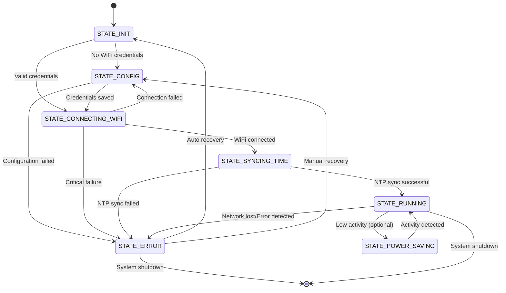

# Finite State Machine - Mechanical Clock with Onboard RTC

## Overview

The Mechanical Clock system uses a robust state machine architecture to manage the complex interactions between hardware components, network connectivity, and user interface. The state machine ensures reliable operation, graceful error handling, and clear system behavior.

## State Machine Architecture

The state machine is implemented in the `StateManager` class and orchestrates the entire system behavior. Each state represents a distinct operational mode with specific responsibilities and transition conditions.

## States

### 1. STATE_INIT (0) - Initialization
**Purpose**: System startup and hardware initialization

**Responsibilities**:
- Initialize hardware components (LCD, RTC, stepper motor)
- Load configuration from EEPROM
- Determine initial state based on system conditions

**Entry Conditions**:
- System power-on or reset
- Hardware initialization complete

**Exit Conditions**:
- All hardware initialized successfully
- Configuration loaded from EEPROM

**Next States**:
- `STATE_CONFIG` (1) - If WiFi credentials invalid or missing
- `STATE_CONNECTING_WIFI` (2) - If WiFi credentials valid

### 2. STATE_CONFIG (1) - Configuration Mode
**Purpose**: WiFi setup via captive portal

**Responsibilities**:
- Start access point mode
- Serve captive portal web interface
- Handle WiFi credential configuration
- Provide user feedback via LCD

**Entry Conditions**:
- No valid WiFi credentials in EEPROM
- WiFi connection failed
- User manually triggered config mode

**Exit Conditions**:
- Valid WiFi credentials saved
- User completed configuration

**Next States**:
- `STATE_CONNECTING_WIFI` (2) - After successful configuration

**Implementation**:
```cpp
void StateManager::_runConfigState() {
    String errorMessage;
    if (!_networkManager.handleConfigPortal(errorMessage)) {
        setLastError(errorMessage);
        transitionTo(STATE_ERROR);
    }
}
```

### 3. STATE_CONNECTING_WIFI (2) - WiFi Connection
**Purpose**: Establish WiFi client connection

**Responsibilities**:
- Attempt WiFi connection using stored credentials
- Handle connection retries and timeouts
- Provide connection status feedback
- Manage connection failure scenarios

**Entry Conditions**:
- Valid WiFi credentials available
- System ready for network operation

**Exit Conditions**:
- WiFi connection established successfully
- Maximum retry attempts exceeded

**Next States**:
- `STATE_SYNCING_TIME` (3) - WiFi connected successfully
- `STATE_RUNNING` (4) - Connection timeout, graceful fallback to running state
- `STATE_CONFIG` (1) - Connection failed, return to config mode

**Implementation**:
```cpp
void StateManager::_runConnectingWiFiState() {
    if (_networkManager.ensureConnection()) {
        transitionTo(STATE_SYNCING_TIME);
    } else if (millis() - _wifiConnectStartTime > 30000UL) {
        // Graceful timeout handling - defer NTP sync and return to running
        _networkManager.resetNtpSyncCounter();
        transitionTo(STATE_RUNNING);
    } else {
        setLastError("WiFi Timeout");
        transitionTo(STATE_ERROR);
    }
}
```

### 4. STATE_SYNCING_TIME (3) - NTP Synchronization
**Purpose**: Synchronize RTC with network time

**Responsibilities**:
- Perform NTP time synchronization
- Apply timezone and DST adjustments
- Update RTC with accurate UTC time
- Handle NTP failures and retries

**Entry Conditions**:
- WiFi connection established
- System ready for time synchronization

**Exit Conditions**:
- RTC synchronized successfully
- Maximum NTP retry attempts exceeded

**Next States**:
- `STATE_RUNNING` (4) - Time synchronized successfully
- `STATE_RUNNING` (4) - NTP sync timeout, graceful fallback to running state
- `STATE_ERROR` (5) - Critical NTP synchronization failure

**Implementation**:
```cpp
void StateManager::_runSyncingTimeState() {
    if (_networkManager.syncTimeWithRTC(_rtc)) {
        _clock.updateCurrentTime();
        transitionTo(STATE_RUNNING);
    } else if (millis() - _ntpSyncStartTime > 30000UL) {
        // Graceful timeout handling - defer NTP sync and return to running
        _networkManager.resetNtpSyncCounter();
        transitionTo(STATE_RUNNING);
    } else {
        setLastError("NTP Sync Failed");
        transitionTo(STATE_ERROR);
    }
}
```

### 5. STATE_RUNNING (4) - Normal Operation
**Purpose**: Main operational state with continuous timekeeping

**Responsibilities**:
- Continuous stepper motor operation
- Periodic NTP re-synchronization
- LCD display updates
- Network status monitoring
- Error detection and handling

**Entry Conditions**:
- RTC synchronized with network time
- All systems operational

**Exit Conditions**:
- Network connection lost
- Critical error detected
- System shutdown requested

**Next States**:
- `STATE_ERROR` (5) - Error detected
- `STATE_POWER_SAVING` (6) - Power saving mode (if implemented)

**Implementation**:
```cpp
void StateManager::_runRunningState() {
    // Check if NTP sync is needed
    if (_networkManager.isNTPSyncNeeded()) {
        if (_networkManager.isWiFiConnected()) {
            // WiFi connected - proceed to NTP sync
            transitionTo(STATE_SYNCING_TIME);
        } else {
            // WiFi disconnected - attempt reconnection first
            transitionTo(STATE_CONNECTING_WIFI);
        }
        return;
    }
    
    // Update clock and display
    _clock.update();
    _lcd.updateDisplay();
}
```

### 6. STATE_ERROR (5) - Error State
**Purpose**: Handle system errors and provide recovery options

**Responsibilities**:
- Display error messages on LCD
- Provide error recovery mechanisms
- Log error information
- Attempt automatic recovery

**Entry Conditions**:
- Any critical error detected
- System failure in any state

**Exit Conditions**:
- Error resolved automatically
- Manual recovery action taken
- System reset

**Next States**:
- `STATE_INIT` (0) - After error resolution
- `STATE_CONFIG` (1) - If WiFi credentials need reconfiguration

**Implementation**:
```cpp
void StateManager::_runErrorState() {
    _lcd.displayError(_lastError);
    
    // Attempt automatic recovery after delay
    if (millis() - _stateStartTime > ERROR_RECOVERY_DELAY) {
        transitionTo(STATE_INIT);
    }
}
```

### 7. STATE_POWER_SAVING (6) - Power Saving Mode
**Purpose**: Reduce power consumption during low-activity periods

**Responsibilities**:
- Reduce stepper motor activity
- Dim LCD display
- Reduce network polling frequency
- Monitor for activity triggers

**Entry Conditions**:
- Low activity detected
- Power saving enabled
- System in running state

**Exit Conditions**:
- Activity detected
- Time-based wake-up
- Manual wake-up

**Next States**:
- `STATE_RUNNING` (4) - Return to normal operation

## State Transition Diagram



## State Machine Implementation

### StateManager Class Structure

```cpp
class StateManager {
private:
    enum ClockState {
        STATE_INIT = 0,
        STATE_CONFIG = 1,
        STATE_CONNECTING_WIFI = 2,
        STATE_SYNCING_TIME = 3,
        STATE_RUNNING = 4,
        STATE_ERROR = 5,
        STATE_POWER_SAVING = 6
    };
    
    ClockState _currentState;
    unsigned long _stateStartTime;
    String _lastError;
    
    // State execution methods
    void _runInitState();
    void _runConfigState();
    void _runConnectingWiFiState();
    void _runSyncingTimeState();
    void _runRunningState();
    void _runErrorState();
    void _runPowerSavingState();
    
public:
    void update();
    void transitionTo(ClockState newState);
    void setLastError(const String& error);
    ClockState getCurrentState() const;
};
```

### State Transition Logic

```cpp
void StateManager::transitionTo(ClockState newState) {
    if (_currentState != newState) {
        Serial.print("State change: ");
        Serial.print(_currentState);
        Serial.print(" -> ");
        Serial.println(newState);
        
        _currentState = newState;
        _stateStartTime = millis();
        
        // State-specific initialization
        switch (_currentState) {
            case STATE_INIT:
                // Initialize hardware
                break;
            case STATE_CONFIG:
                // Start AP mode
                break;
            case STATE_RUNNING:
                Serial.println("Entering normal operation...");
                break;
            case STATE_ERROR:
                Serial.print("Entering error state: ");
                Serial.println(_lastError);
                break;
        }
    }
}
```

## Error Handling Strategy

### Error Categories

1. **Recoverable Errors**: Network timeouts, temporary NTP failures
   - Automatic retry with exponential backoff
   - Graceful degradation to local time

2. **Configuration Errors**: Invalid WiFi credentials, missing settings
   - Return to configuration mode
   - User intervention required

3. **Hardware Errors**: LCD failure, stepper motor issues
   - Error state with diagnostic information
   - Manual recovery required

4. **Critical Errors**: System corruption, memory issues
   - System reset or shutdown
   - Requires hardware intervention

### Error Recovery Mechanisms

```cpp
void StateManager::handleError(const String& error, bool isRecoverable) {
    setLastError(error);
    
    if (isRecoverable) {
        // Attempt automatic recovery
        transitionTo(STATE_ERROR);
    } else {
        // Require manual intervention
        transitionTo(STATE_ERROR);
    }
}
```

## State Persistence

### EEPROM State Storage

The system stores critical state information in EEPROM to survive power cycles:

```cpp
struct SystemState {
    bool hasValidCredentials;
    int timeZoneOffset;
    bool useDST;
    time_t lastSyncTime;
    bool isConfigured;
};
```

### State Recovery on Boot

```cpp
void StateManager::recoverState() {
    SystemState state;
    EEPROM.get(EEPROM_ADDR_SYSTEM_STATE, state);
    
    if (state.isConfigured && state.hasValidCredentials) {
        transitionTo(STATE_CONNECTING_WIFI);
    } else {
        transitionTo(STATE_CONFIG);
    }
}
```

## Network Resilience (V2.1.2+)

### Graceful Timeout Handling

The state machine now implements graceful timeout handling to prevent infinite reconnection loops:

#### **WiFi Connection Timeout**
- **Timeout Duration**: 30 seconds
- **Behavior**: Instead of transitioning to `STATE_ERROR`, the system:
  1. Calls `_networkManager.resetNtpSyncCounter()` to defer the next NTP sync attempt
  2. Transitions to `STATE_RUNNING` to continue normal operation
  3. Allows the system to function with local RTC time until network is available

#### **NTP Sync Timeout**
- **Timeout Duration**: 30 seconds
- **Behavior**: Similar to WiFi timeout:
  1. Calls `_networkManager.resetNtpSyncCounter()` to defer the next sync attempt
  2. Transitions to `STATE_RUNNING` to continue normal operation
  3. Maintains clock functionality with existing RTC time

### Smart NTP Sync Management

#### **Sync Trigger Logic**
```cpp
// In STATE_RUNNING
if (_networkManager.isNTPSyncNeeded()) {
    if (_networkManager.isWiFiConnected()) {
        // WiFi connected - proceed to NTP sync
        transitionTo(STATE_SYNCING_TIME);
    } else {
        // WiFi disconnected - attempt reconnection first
        transitionTo(STATE_CONNECTING_WIFI);
    }
}
```

#### **Sync Counter Management**
- **Deferred Sync**: When network is unavailable, sync attempts are deferred
- **Automatic Recovery**: When network becomes available, sync resumes automatically
- **No Infinite Loops**: System always returns to `STATE_RUNNING` after timeouts

### Benefits of Network Resilience

1. **Continuous Operation**: Clock continues to function even during network outages
2. **Automatic Recovery**: System automatically resumes network operations when available
3. **No Manual Intervention**: No need to reset the device after network failures
4. **Graceful Degradation**: System degrades gracefully from network time to local RTC time
5. **Resource Efficiency**: Prevents wasteful infinite reconnection attempts

## Performance Considerations

### State Execution Timing

- **STATE_INIT**: < 100ms (hardware initialization)
- **STATE_CONFIG**: Continuous (until user configuration)
- **STATE_CONNECTING_WIFI**: 30 seconds timeout (graceful fallback to RUNNING)
- **STATE_SYNCING_TIME**: 30 seconds timeout (graceful fallback to RUNNING)
- **STATE_RUNNING**: Continuous (main loop)
- **STATE_ERROR**: 5 seconds auto-recovery delay

### Memory Usage

- State machine overhead: ~200 bytes
- Error message storage: ~64 bytes
- State transition history: ~128 bytes

## Testing Strategy

### State Machine Testing

1. **Unit Tests**: Individual state behavior
2. **Integration Tests**: State transitions
3. **Error Injection**: Simulate various failure modes
4. **Recovery Tests**: Verify error recovery mechanisms

### Test Coverage

- All state transitions
- Error handling scenarios
- Power cycle recovery
- Network failure recovery
- Configuration edge cases

---

*This document should be updated as the state machine evolves or new states are added.* 